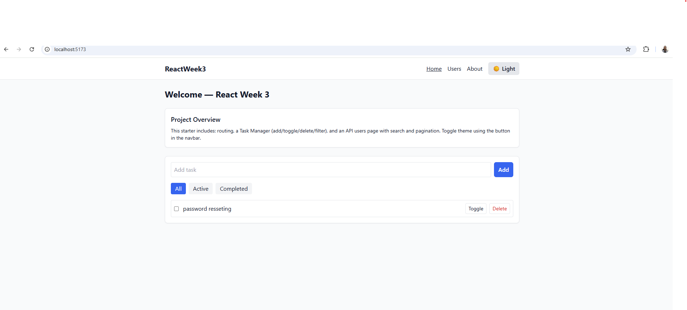
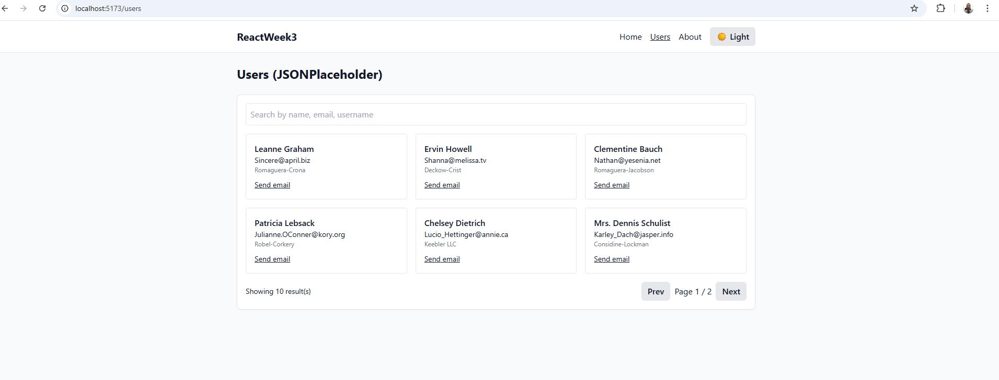
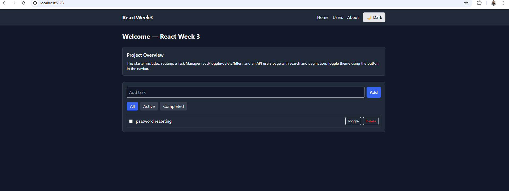
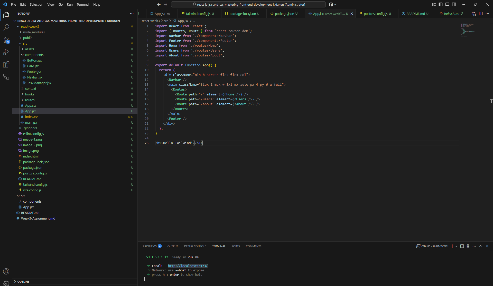

🖥 React Week 3 – Front-End Mastery

A modern React application built with Vite, Tailwind CSS, and React Router DOM, demonstrating:

Component-based architecture

State management with hooks

API integration

Responsive design

Dark/Light theme toggle

🎯 Project Objective

Create a responsive React application using JSX and Tailwind CSS to demonstrate:

Reusable component architecture

React state management with hooks (useState, useEffect, useContext)

API integration with fetch & pagination

Responsive design with dark/light mode support

Task management system

🗂 Project Structure
react-week3/
├─ package.json
├─ index.html
├─ vite.config.js
├─ tailwind.config.cjs
├─ postcss.config.cjs
├─ src/
│  ├─ main.jsx
│  ├─ index.css
│  ├─ App.jsx
│  ├─ routes/
│  │  ├─ Home.jsx
│  │  ├─ About.jsx
│  │  └─ Users.jsx
│  ├─ components/
│  │  ├─ Navbar.jsx
│  │  ├─ Footer.jsx
│  │  ├─ Button.jsx
│  │  ├─ Card.jsx
│  │  └─ TaskManager.jsx
│  ├─ context/
│  │  └─ ThemeContext.jsx
│  └─ hooks/
│     └─ useLocalStorage.jsx
└─ README.md

⚡ Features
1. Routing

Multi-page support with react-router-dom

Pages: Home, Users, About

2. Task Manager

Add, toggle, delete, and filter tasks

Persist tasks in localStorage using a custom useLocalStorage hook

Filters: All, Active, Completed

3. API Integration

Fetch user data from JSONPlaceholder

Display users in responsive cards

Search functionality and pagination

4. Theme Switcher

Dark/Light mode toggle using Tailwind’s dark variant

Persistent theme stored in localStorage

5. Reusable Components

Button with multiple variants (primary, secondary, danger)

Card for boxed content

Navbar and Footer for consistent layout

🛠 Setup Instructions
Prerequisites

Node.js v18 or higher

npm package manager

1️⃣ Clone the Repository
git clone <your-repo-url>
cd react-week3

2️⃣ Install Dependencies
npm install

This installs:

React 18.3

Vite 5.4.x

Tailwind CSS 3.x

React Router DOM 6.x

PostCSS + Autoprefixer

3️⃣ Start Development Server
npm run dev

Open http://localhost:5173 in your browser.
The app supports hot reloading, so changes appear immediately.

4️⃣ Build for Production
npm run build

This generates the production-ready files in the dist/ folder.

5️⃣ Preview Production Build
npm run preview

📦 Scripts
Command	Description
npm run dev	Run development server with hot reload
npm run build	Build production-ready app
npm run preview	Preview production build locally
🧩 Technical Stack

React 18.3 – Front-end UI library

Vite 5.4.x – Development server & bundler

Tailwind CSS 3.x – Utility-first CSS framework

React Router DOM 6.x – SPA routing

PostCSS + Autoprefixer – CSS processing

LocalStorage – Persist user tasks

🖼 Screenshots
Home Page & Task Manager

Users Page (API)

Dark Mode

🔗 Live Demo

Deployed on Vercel / Netlify / GitHub Pages:

https://react-week3.vercel.app
 (replace with your actual URL)

📝 Notes

Fully ESM-compatible (import/export)

Tailwind directives are correctly processed by PostCSS

Dark/Light theme persists using localStorage

Fully responsive design for mobile, tablet, and desktop

🎓 Author

Kidane Negash – Core System Administrator & Front-End Enthusiast developer!